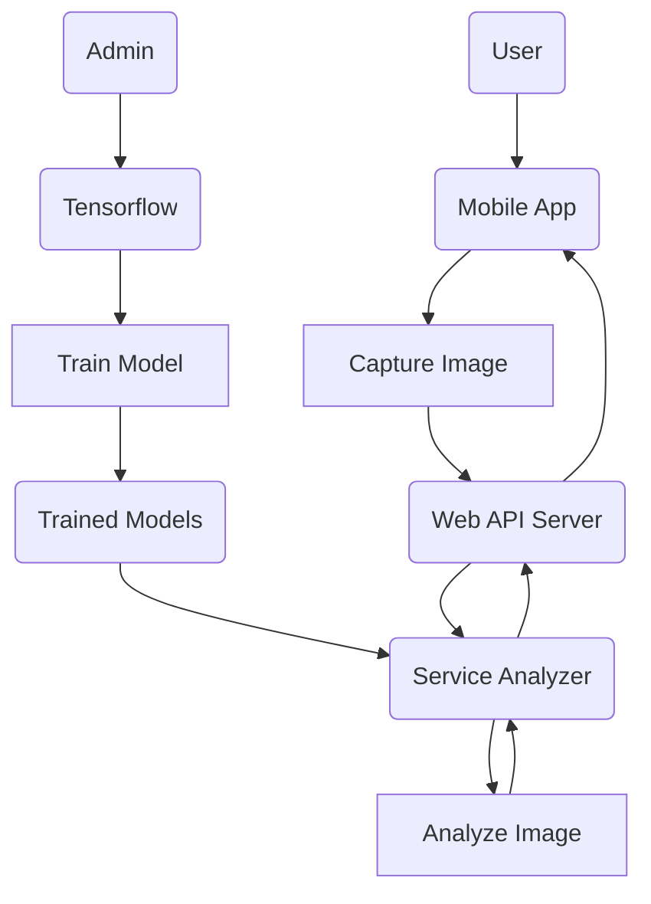

# e-Tomato

A Tomato Growth Monitoring and Diseases Analyzer using SVM Algorithm | Image segmetation

## System Flow Chart of Proposed Methodology

## Technologies Stack

1. [Flutter](https://flutter.dev/) for mobile development
2. [Tensorflow](https://www.tensorflow.org/) for machine learning
3. [.NET](https://dotnet.microsoft.com/en-us/) for web api and service analyzer
4. [SQLite](https://www.sqlite.org/index.html) for data persistence
5. [Docker](https://www.docker.com/) for deployment
